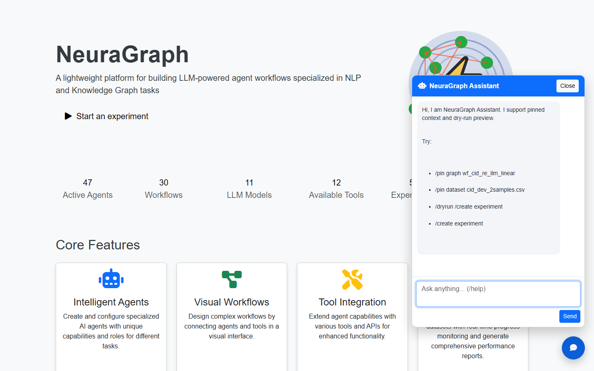

# Chat Command Spec and User Guide

Slash commands work identically in:

- **Floating UI assistant** — bottom-right chat widget on every page (`/chat/api/message`)
- **Terminal chat** — `python chat.py` from repo root

Shared implementation: `service/chat/commands.py`

UI walkthrough: [MANUAL.md §8](MANUAL.md#8-floating-assistant-chat-widget) · Screenshot: `doc/images/page_chat_help.png`

---

## 1. Opening the Assistant

1. Start NeuraGraph (`.\start.bat`)
2. Open any page at http://127.0.0.1:5001
3. Click the blue **chat bubble** (bottom-right)
4. Type `/help` and press **Send**



---

## 2. Command Reference

### 2.1 Context and preview

| Command | Description |
|---------|-------------|
| `/pin show` | Show pinned graph/exp/dataset |
| `/pin clear` | Clear all pins |
| `/pin graph <id>` | Pin workflow for subsequent commands |
| `/pin exp <id>` | Pin experiment |
| `/pin dataset <file>` | Pin dataset filename |
| `/dryrun <command>` | Parse command without side effects |

### 2.2 List and show

| Command | Example |
|---------|---------|
| `/list workflows` | All workflow families |
| `/list agents` | All agents |
| `/list tools` | All tools |
| `/list datasets` | CSV files by runner |
| `/list llms` | LLM connectors |
| `/list experiments` | Experiment metadata |
| `/show workflow <id>` | Graph JSON summary |
| `/show agent <id>` | Agent definition |
| `/show tool <id>` | Tool definition |
| `/show dataset <runner>/<file>` | Dataset preview |
| `/show llm <id>` | LLM config (masked key) |
| `/show experiment <exp_id>` | Experiment status + datasets |

### 2.3 Create and run

| Command | Description |
|---------|-------------|
| `/create testset <runner_id> <filename> [source] [count]` | Create sampled CSV |
| `/create experiment [runner_id] [dataset] [runner_type]` | Uses pins when args omitted |
| `/run workflow <id> {json}` | Single-shot workflow invoke |
| `/run agent <id> {json}` | Single-shot agent invoke |
| `/run experiment <exp_id>` | Start batch run (SSE in UI) |

### 2.4 Copy, optimize, delete

| Command | Description |
|---------|-------------|
| `/copy workflow <source> <target>` | Duplicate graph JSON |
| `/copy agent <source> <target>` | Duplicate agent |
| `/optimize <exp_id> [max_updates]` | Run optimization loop |
| `/delete workflow\|agent\|tool\|llm\|experiment <id>` | Remove meta file |

### 2.5 Orchestration

| Command | Description |
|---------|-------------|
| `/orchestrate <goal>` | End-to-end: generate → run → report → compare |

Natural language (non-slash) messages are forwarded to the configured LLM with project context when available.

---

## 3. Typical Workflows

### 3.1 Quick experiment from chat

```
/pin graph wf_cid_re_llm_linear
/list datasets
/create experiment
/run experiment <returned_exp_id>
```

### 3.2 Optimize an existing experiment

```
/show experiment <exp_id>
/optimize <exp_id> 3
/list workflows
/show workflow wf_cid_re_llm_linear_opt_20260529_143039_r1
```

### 3.3 Safe preview

```
/dryrun /delete workflow my_test_wf
/dryrun /optimize abc-123-def 5
```

---

## 4. Architecture

```
ui/chat_api.py          Session id, HTTP entry
chat.py                 Terminal entry (interactive + slash)
service/chat/commands.py
  ├─ parse slash tokens
  ├─ session pins (in-memory per session)
  ├─ markdown card responses
  └─ /orchestrate multi-step pipeline
```

**Output style**: Markdown cards or concise text — terminal and UI should show equivalent semantics for the same command.

---

## 5. Regression Tests

Full guide and **report links**: [TESTING.md](TESTING.md) · [ui_tests/reports/README.md](../ui_tests/reports/README.md)

| Suite | Path |
|-------|------|
| All suites (entry) | `ui_tests/run_tests.py` (`--suite unit\|agents\|agents-live\|graphs\|…`) |
| Chat commands | `ui_tests/unit/test_chat_commands.py` |
| Report constraints | `ui_tests/unit/test_report_regression.py` |
| All agents (mock LLM) | `--suite agents` → [agent_test_report_mock_latest.md](../ui_tests/reports/agent_test_report_mock_latest.md) |
| Agents (live LLM) | `--suite agents-live` → [agent_test_report_live_latest.md](../ui_tests/reports/agent_test_report_live_latest.md) |
| Graph workflows | `--suite regression-graph` → [graph_suite_report_latest.md](../ui_tests/reports/graph_suite_report_latest.md) |

```powershell
set PYTHONPATH=%CD%
py -3 ui_tests/run_tests.py --suite unit
py -3 ui_tests/run_tests.py --suite agents
py -3 ui_tests/run_tests.py --suite agents-live
```

---

## 6. Acceptance Checklist

- [ ] Same slash command → same semantic output in terminal and UI
- [ ] `/create experiment` respects pinned graph/dataset defaults
- [ ] `/dryrun` never mutates filesystem or runs workflows
- [ ] `/optimize` creates candidate experiments visible in `/exp` tree
- [ ] Report pages render inline charts without overflow

---

## 7. Related Documents

- [MANUAL.md](MANUAL.md) — full UI guide with screenshots
- [SUPPLEMENTARY.md](SUPPLEMENTARY.md) — supplementary material and component inventory
- [EXPERIMENT_GUIDE.md](EXPERIMENT_GUIDE.md) — optimization pipeline details
- [CODE_WIKI.md](CODE_WIKI.md) — `service/chat/commands.py` module map
