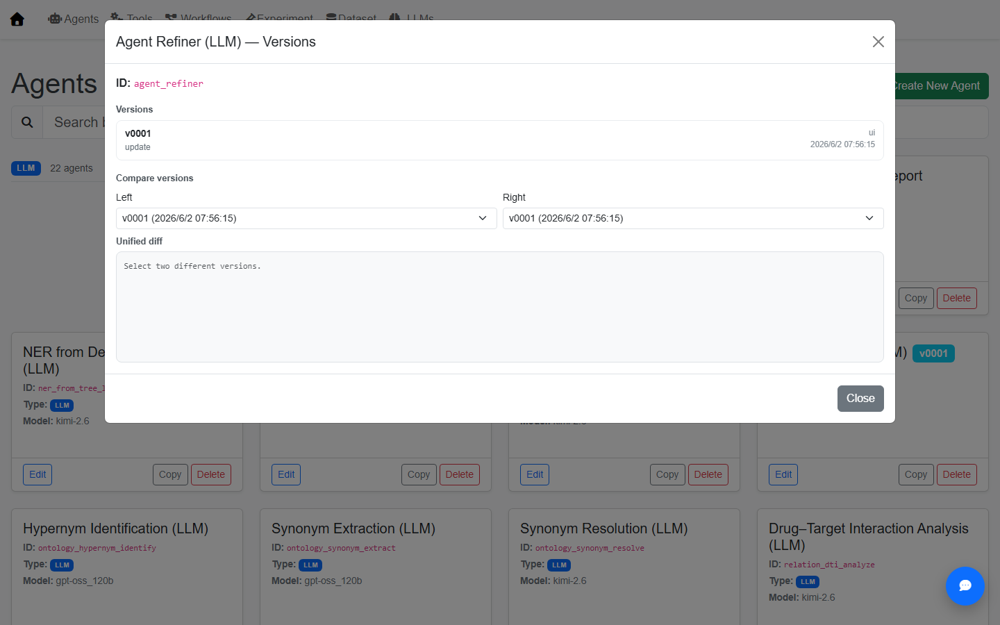
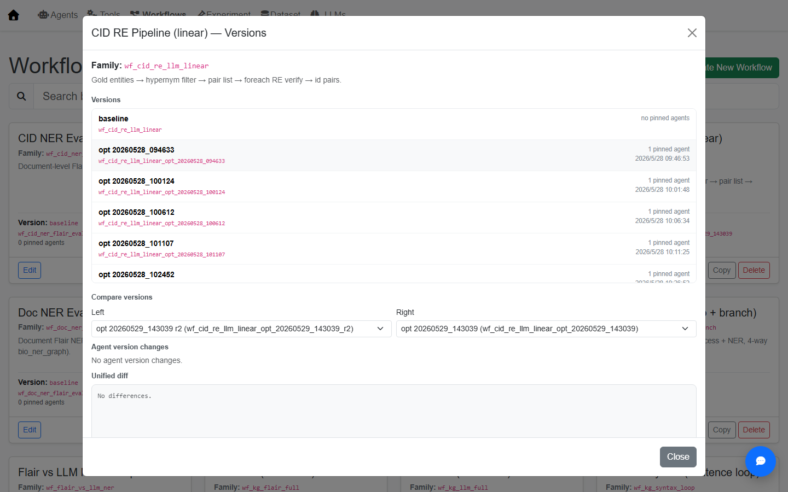
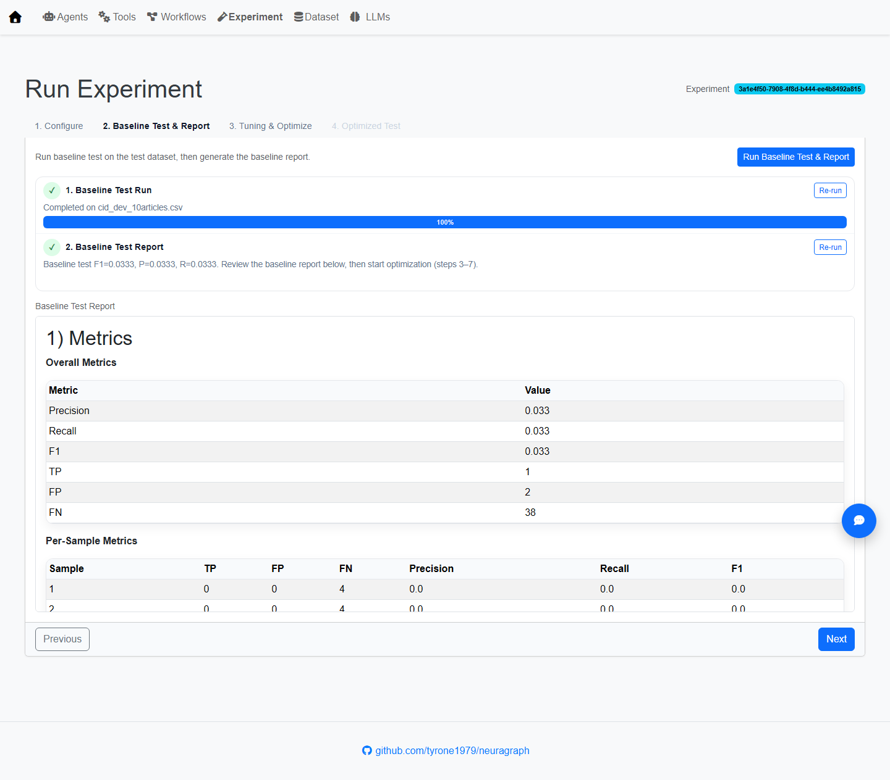
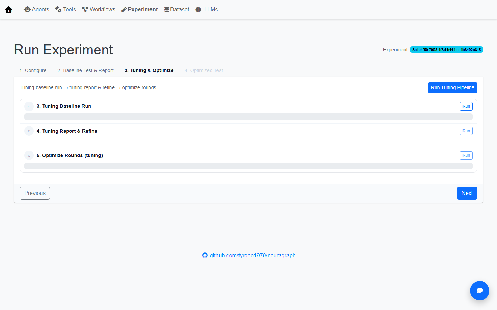
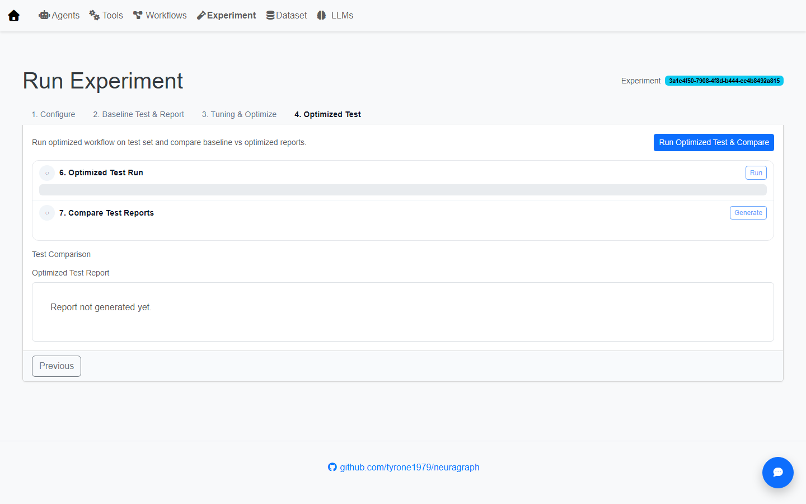
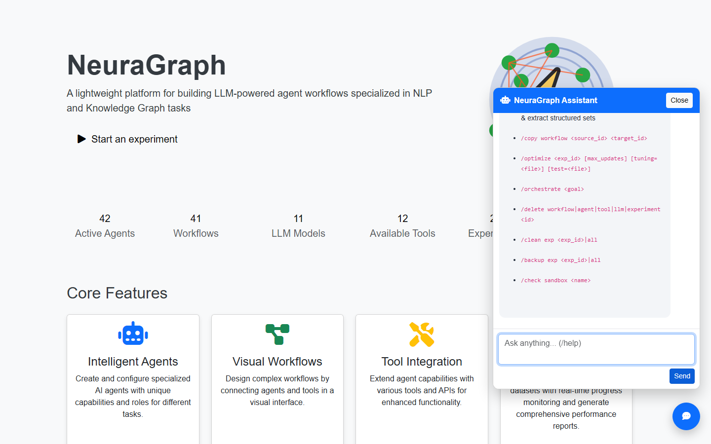

# NeuraGraph User Manual

[README](../README.md) · [CODE_WIKI](CODE_WIKI.md) · [EXPERIMENT_GUIDE](EXPERIMENT_GUIDE.md) · [CHAT_COMMANDS](CHAT_COMMANDS.md)

This manual is for **end users**. It walks through NeuraGraph features page by page. Each major step includes a screenshot (stored in `doc/images/`).

> **Refreshing screenshots**: With the server running from the project root, run `py -3 scripts/refresh_manual_screenshots.py` to batch-refresh screenshots.

---

## Table of Contents

1. [First Launch and Home Page](#1-first-launch-and-home-page)
2. [Configure LLM Models](#2-configure-llm-models)
3. [Agent Management](#3-agent-management)
4. [Workflow Editor](#4-workflow-editor)
5. [Experiment and Optimization](#5-experiment-and-optimization)
6. [Dataset Test Sets](#6-dataset-test-sets)
7. [Tools](#7-tools)
8. [Floating Assistant Chat Widget](#8-floating-assistant-chat-widget)
9. [FAQ and Best Practices](#9-faq-and-best-practices)

---

## 1. First Launch and Home Page

### 1.1 Start the Server

**Windows (recommended)**

```powershell
cd D:\projects\agentic_llmre
.\start.bat
```

`start.bat` will: free ports 5001/5002 → start the plugin sandbox → start the Flask UI (debug mode).

**Manual startup**

```powershell
.\venv\Scripts\Activate.ps1
py -m pip install -r requirements.txt
python -m ui.app
```

Open in your browser: **http://127.0.0.1:5001**

### 1.2 Home Page Overview

The home page shows platform statistics and quick links:

| Area | Description |
|------|-------------|
| Hero | Platform intro; **Start an experiment** opens the new-experiment flow; **Documentation** opens docs |
| Stat cards | Counts for Agents / Workflows / LLM Models / Tools / Experiments / Data sets — click to jump to each module |
| Core Features | Four capability overview cards |
| Quick Actions | Create Agent, Workflow, Experiment; view Dataset; create LLM |


### 1.3 Top Navigation Bar

All inner pages (except home) share the same nav bar, left to right:

| Menu item | Path | Function |
|-----------|------|----------|
| Home | `/` | Return to home |
| Agents | `/agents` | Agent list and editor |
| Tools | `/tools` | Python tools callable by LLMs |
| Workflows | `/graph` | Visual workflow editor |
| Experiment | `/exp` | Batch experiments and optimization pipeline |
| Dataset | `/testset` | Test CSV management |
| LLMs | `/llms` | LLM connector configuration |


The blue circular button in the bottom-right corner is the **floating assistant** (see Section 8).

---

## 2. Configure LLM Models

Before using LLM-type agents, configure at least one LLM connector.

### 2.1 Create an LLM

**Path**: Home → Quick Actions → **Create New LLM**, or nav **LLMs** → New.


### 2.2 Fill Out the Form

| Field | Description |
|-------|-------------|
| ID | Unique identifier; referenced by the agent `model` field |
| Type | Provider type (OpenAI-compatible, Azure, etc.) |
| Model | Model name, e.g. `gpt-4o`, `deepseek-chat` |
| Base URL | API endpoint |
| API Key | Secret key (stored locally under `meta/llms/`) |
| Temperature / Max Tokens | Optional generation parameters |

Click **Create** to save.


### 2.3 Test Connection

On the LLM edit page, click **Test Connection** to verify the endpoint and key.


---

## 3. Agent Management

Agents are the smallest execution units in a workflow. There are three types.

### 3.1 Agent List

Nav **Agents** → card grid of all agents, grouped by type (LLM / PGM / SUB).

- Each card shows name, ID, and input/output summary
- If version history exists, the card shows an **N versions** badge; click to open the version history modal (see 3.5)
- **Create New Agent** at the top creates a new agent


### 3.2 Agent Types and Edit Panels

#### LLM Agent

- Configure `model` (LLM ID reference), `prompt_template` (system / human)
- Optionally bind `tools` (tool IDs from `meta/tools`)
- Supports `output_parse`, `default_labels`, and other parsing options


#### PGM Agent

- Local Python process; reads inputs from `state`, writes output via `__result__`
- Runs in a sandbox; suited for deterministic data processing, Flair NER, etc.


#### SUB Agent (legacy)

- Legacy subgraph loop controller; **for new workflows, use Workflow `flowNodes.loop` instead**


### 3.3 Inline Agent Testing

The right side of the edit page is the **Test Panel**:

1. Select preset JSON input from `/tests/<agent_id>/`, or edit manually
2. Click **Run Test**
3. View streaming output and final state


### 3.4 Agent Form Field Reference

| Field | LLM | PGM | Description |
|-------|-----|-----|-------------|
| inputs | ✓ | ✓ | List of fields read from state |
| outputs.name | ✓ | ✓ | State key written |
| prompt_template | ✓ | — | system / human template with `{field}` placeholders |
| process | — | ✓ | Python code assigning `__result__` |
| tools | optional | — | List of tool IDs |
| sandbox / engine | optional | optional | e.g. `flair` engine |

### 3.5 Version History and Compare

Click the version badge on a card to open the **Versions** modal:

- Lists each save snapshot (time, source, change notes)
- **Compare versions**: pick two versions side by side for JSON diff
- The agent edit page also has a version dropdown for diff at the bottom



---

## 4. Workflow Editor

A workflow (graph) orchestrates multiple agents into a DAG with loops, branches, and subgraphs.

### 4.1 Workflow List

Nav **Workflows**:

- Cards grouped by **family** (family ID)
- Search by name, family id, or version id
- Multi-version workflows show an **N versions** badge
- **Create New Workflow** creates a blank workflow (with START / END nodes)


#### Versions Modal

Click **N versions** to see all variants under the same family (e.g. baseline, `opt_*` optimized versions):

- Each version shows variant label, runner id, pinned agent count
- Select two versions for **graph diff** and **agent version changes** comparison
- Jump to edit or copy directly



### 4.2 Visual Editor Layout

After opening a workflow edit page, the UI is divided into:

| Area | Description |
|------|-------------|
| Left Component Panel | Draggable agent list, subgraphs, search filter |
| Center Canvas | JointJS canvas with nodes and edges |
| Right Property Panel | Selected node properties, bindings, prompt |
| Top Toolbar | Select/connect/delete, Undo/Redo, background color, save |


### 4.3 Common Edit Operations

| Action | Method |
|--------|--------|
| Add agent | Drag from left panel onto canvas |
| Connect | Toolbar **Connect**, click source then target port |
| Edit node | Click node → edit name, bindings, prompt on the right |
| Delete | Select node → Toolbar **Delete** or context menu |
| Save | **Ctrl+S** or toolbar Save |
| Export | Right-click canvas background → Export SVG/PNG |
| Create agent | Right-click → Create Agent (quick-create from node) |

### 4.4 Subgraphs

Workflows containing `sg_*` subgraphs show a **pink semi-transparent rectangle** on the canvas marking subgraph bounds and name.


### 4.5 Property Panel and Agent Test

When an agent node is selected, the right panel shows:

- Node ID, type, inputs/outputs
- Graph **bindings** (`{{ START.field }}` syntax)
- Editable LLM prompt fields
- **Test Agent**: single-node test modal


### 4.6 Full-Graph Test

Toolbar or top **Test Workflow** opens the full-graph test modal:

- Select a CSV sample row or JSON from `/tests/<workflow_id>/`
- Run and inspect per-step state and final output


### 4.7 Agent Version Pinning (agentVersions)

Workflow variants from the optimization pipeline may **pin** specific agent snapshot versions in `agentVersions`. When editing such workflows, nodes use pinned versions instead of the latest in `meta/agents`.

---

## 5. Experiment and Optimization

The Experiment module supports: **batch evaluation**, **baseline reports**, **tuning-set optimization**, and **post-optimization comparison**.

### 5.1 Experiment List (Tree View)

Nav **Experiment**:

Experiments are organized in a three-level tree:

```
Family (workflow family)
  └── Version (runner variant: baseline / opt_r1 / opt_r2 …)
        └── Dataset (test_dataset [+ tuning_dataset])
              └── Experiment rows (exp_id, status, F1, etc.)
```

- Top search: family, version, dataset, exp id
- Click a leaf node to open experiment details
- **New Experiment** creates an experiment


### 5.2 Four-Step Wizard

After creating or opening an experiment, the page is a **4-step tab wizard**:

| Tab | Name | Function |
|-----|------|----------|
| 1 | Configure | Select runner, test/tuning datasets, preview samples |
| 2 | Baseline Test & Report | Run baseline on test set + generate baseline report |
| 3 | Tuning & Optimize | Tuning baseline → tuning report → agent optimization rounds |
| 4 | Optimized Test | Re-test optimized workflow + compare baseline vs optimized reports |


### 5.3 Step 1: Configure Details

#### Runner Selector

- Search and select a **Workflow** (`runner_type=graph`) or a single **Agent**
- After selecting a workflow, the **Workflow agents** table below shows each agent and its **current version**

#### Test Dataset / Tuning Dataset

| Field | Purpose |
|-------|---------|
| **Test Dataset** | Held-out test CSV for final evaluation |
| **Tuning Dataset** | Tuning CSV used during optimization (refine / candidate rounds) |

Both dropdowns list files from `tests/<runner_id>/`.

#### Auto Split

When **Auto split (CSV)** is checked:

| Field | Description |
|-------|-------------|
| Source | Select source CSV |
| Tuning Ratio | Tuning set fraction (default 0.8) |
| Seed | Random seed (default 42) |

The system generates test / tuning files using stratified splitting (see `EXPERIMENT_GUIDE.md`).

#### Sample Preview

After selecting a dataset, **Test Set Preview** paginates CSV rows so you can confirm column names and gold fields.

Click **Next** to save and proceed to step 2 (save first to obtain an `exp_id`).

### 5.4 Step 2: Baseline Test & Report



1. Click **Run Baseline Test & Report**
2. The **optimization flow** step bar shows progress: `baseline_test` → `baseline_test_report`
3. **Baseline Test Report** renders below (Markdown + inline charts)

The report is generated by the `report_experiment` agent from full states, including P/R/F1 and error analysis.


**Replay modal**: In the experiment progress table, click a sample row to open JSON state details.

### 5.5 Step 3: Tuning & Optimize



Click **Run Tuning Pipeline** to run, in order:

| Step ID | Description |
|---------|-------------|
| `baseline_tuning` | Run current workflow on tuning dataset |
| `baseline_tuning_report` | Generate tuning-set baseline report |
| `optimize_rounds` | Call `agent_refiner` to analyze reports and patch agents; create candidate workflows (`wf_*_opt_*_r1`, etc.) |

When complete, the **Optimize Loop Result** panel shows:

- Candidate / pinned experiment IDs per round
- Agent change summary and F1 delta
- Best round and copied optimized workflow id

SSE pushes progress in real time; do not close the page during long runs.

### 5.6 Step 4: Optimized Test



1. Click **Run Optimized Test & Compare**
2. Re-run the optimized workflow on the **Test Dataset**
3. **Test Comparison** compares baseline vs optimized metrics
4. **Optimized Test Report** shows the final report

### 5.7 Experiment State and Result Files

| Location | Content |
|----------|---------|
| `meta/exps/<exp_id>.json` | Experiment config, progress, optimization flow state |
| `result/<exp_id>/states.json` | Per-sample final state + metrics |
| `result/<exp_id>/report_*.md` | Generated Markdown reports |

### 5.8 Run Experiments via Assistant

The floating assistant supports:

```
/create experiment [runner_id] [dataset]
/run experiment <exp_id>
/optimize <exp_id> [max_updates]
```

See [CHAT_COMMANDS.md](CHAT_COMMANDS.md) for details.

---

## 6. Dataset Test Sets

Nav **Dataset** (route `/testset`) to manage CSV test sets per runner.


### 6.1 Directory Convention

```
tests/
  <runner_id>/          # workflow id or agent id
    dev10.csv
    test.csv
    tuning.csv
    ...
```

CSV column names must match workflow **START** inputs and gold fields in `metrics`.

### 6.2 Page Features

| Feature | Description |
|---------|-------------|
| Browse by runner | Expand to see all CSVs for that workflow |
| Upload | Upload a new CSV to the runner directory |
| View | Structured preview table |
| Delete | Remove a file |
| API Split | Stratified test/tuning split from raw data (`/testset/api/split`) |

### 6.3 PubTator / CID Datasets

For PubTator relation extraction workflows (e.g. `wf_re_pubtator_dev10`), use scripts or service APIs to build CSVs from PubTator annotations (see `service/dataset_cid.py`, `service/pubtator_client.py`).

---

## 7. Tools

Tools are Python functions for LLM agent **function calling**, defined under `meta/tools/`.

### 7.1 Tool List

Nav **Tools** → card grid similar to workflows, with version badges.


### 7.2 Edit Tool

| Field | Description |
|-------|-------------|
| name / description | Tool name and description visible to the model |
| parameters | JSON Schema parameter definition |
| code | Executable Python code |
| sandbox | Optional sandbox configuration |


### 7.3 Version History

Same as agents: click the version badge to view snapshots and diff.


---

## 8. Floating Assistant Chat Widget

The **blue chat button** in the bottom-right of every page opens the NeuraGraph Assistant.


### 8.1 Basic Usage

- Ask questions in natural language (requires a configured LLM)
- Type `/help` to list commands



### 8.2 Common Slash Commands

| Command | Function |
|---------|----------|
| `/list workflows\|agents\|tools\|datasets\|llms\|experiments` | List resources |
| `/show workflow <id>` | View details |
| `/create experiment [runner] [dataset]` | Create experiment |
| `/run experiment <exp_id>` | Run experiment |
| `/optimize <exp_id>` | Start optimization |
| `/copy workflow <src> <dst>` | Copy workflow |
| `/pin graph <id>` | Pin context |
| `/dryrun <command>` | Preview command without executing |

Full command reference: [CHAT_COMMANDS.md](CHAT_COMMANDS.md).

Terminal users can also run `chat.py` for the same command semantics.

---

## 9. FAQ and Best Practices

### 9.1 Startup Failures

| Symptom | Fix |
|---------|-----|
| `ModuleNotFoundError: flask_cors` | `py -m pip install flask-cors` |
| Port 5001 in use | Stop the occupying process or change the port in `ui/app.py` |
| PubTator HTTPS errors | Install `requests` and `certifi` |

### 9.2 Experiment Metrics Are 0 or N/A

- Confirm CSV gold column names match graph `metrics.expected.field`
- Confirm predicted fields exist in each sample's final state
- For relation extraction, check whether `service/relation_normalize.py` MeSH normalization is required

### 9.3 Optimization Has No Effect

- Is the tuning set large enough to represent error patterns? (≥ 10 samples recommended)
- Check `optimize_rounds` logs for `agent_refiner` suggestions rejected by the suggestion filter
- Compare agent diff between `meta/graphs/wf_*_opt_*` and baseline

### 9.4 Development Tips

- Prefer **flowNodes.loop** over SUB agents for new workflows
- Pass single-sample **Test Workflow** in the graph editor before batch experiments
- Fix LLM temperature when comparing experiments to reduce randomness
- Rely on version snapshots before major agent changes for diff and rollback

---

## Appendix: Screenshot Index

| Filename | Content |
|----------|---------|
| `homepage.png` | Home page |
| `menu.png` | Navigation bar |
| `page_new_llm.png` | LLM form |
| `btn_create_LLM.png` | Create LLM button |
| `btn_test_connection.png` | Test connection |
| `page_agent_list.png` | Agent list |
| `page_agent_left.png` | LLM Agent editor |
| `page_agent_pgm_left.png` | PGM Agent editor |
| `page_agent_sub_left.png` | SUB Agent editor |
| `page_agent_test_right.png` | Agent test panel |
| `page_agent_test_output_right.png` | Agent test output |
| `page_agent_versions_modal.png` | Agent versions modal |
| `page_graph_list.png` | Workflow list |
| `page_graph_versions_modal.png` | Workflow versions modal |
| `page_graph_edit_panel.png` | Workflow editor left panel |
| `page_graph_graph_panel.png` | Workflow canvas |
| `page_graph_subgraph.png` | Subgraph highlight |
| `page_graph_right_panel.png` | Node property panel |
| `page_graph_agent_test.png` | Single-node test |
| `page_graph_graph_test.png` | Full-graph test |
| `page_exp_list.png` | Experiment tree list |
| `page_exp_new.png` | Experiment Configure |
| `page_exp_wizard_baseline.png` | Experiment Baseline step |
| `page_exp_wizard_tuning.png` | Experiment Tuning step |
| `page_exp_wizard_final.png` | Experiment Final step |
| `page_exp_running.png` | Experiment running/completed |
| `page_exp_report.png` | Baseline report |
| `page_dataset_list.png` | Dataset list |
| `page_tools_list.png` | Tools list |
| `page_tools_edit.png` | Tools editor |
| `page_tool_versions_modal.png` | Tool versions modal |
| `page_chat_widget.png` | Floating assistant |
| `page_chat_help.png` | /help command output |
